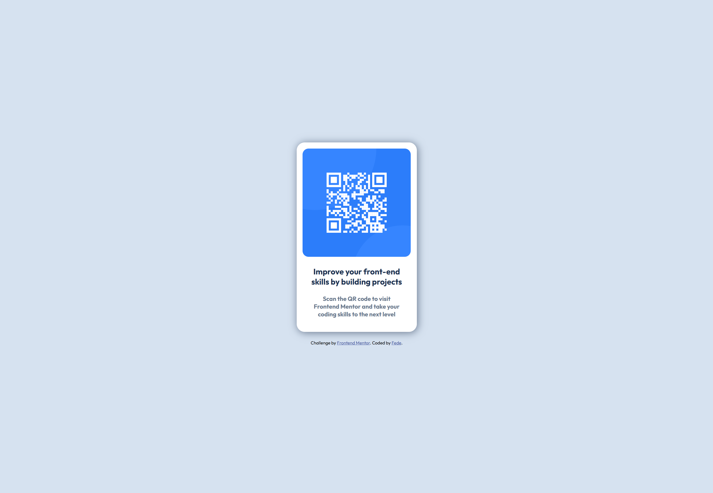

# Frontend Mentor - QR code component solution

This is a solution to the [QR code component challenge on Frontend Mentor](https://www.frontendmentor.io/challenges/qr-code-component-iux_sIO_H). Frontend Mentor challenges help you improve your coding skills by building realistic projects.

## Table of contents

- [Screenshot](#screenshot)
- [My process](#my-process)
  - [Built with](#built-with)
  - [What I learned](#what-i-learned)
- [Author](#author)

### Screenshot

## My process

I used Flexbox on the body element to center the card both vertically and horizontally. I set the image to width: 100% so it scales properly within its container. Finally, I defined the spacing (padding and margins) and applied the project's color scheme using CSS variables.

### Built with

- Semantic HTML5 markup
- CSS custom properties
- Css Variables
- Flexbox

### What I learned

Through this challenge, I strengthened my core understanding of HTML and CSS, especially in creating clean layouts and writing maintainable styles.

## Author

- Frontend Mentor - [@FedeLearnsToCode](https://www.frontendmentor.io/profile/yourusername)
